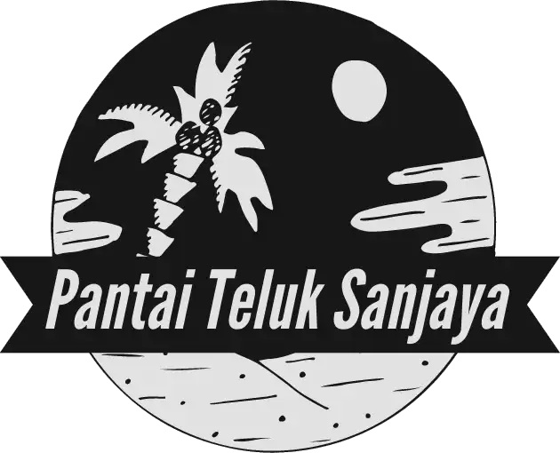

<p align="center"></p>

<h1 align="center">Website Pantai Teluk Sanjaya 🏖️</h1>

Repository ini memuat source code website pantai teluk sanjaya yang dibuat dengan menggunakan framework Vue JS.

## Instalasi

1. Clone repository
    ```sh
    git clone https://github.com/harisfi/dw-pts-app.git
    ```

2. Gunakan package manager [npm](https://npmjs.com/) untuk mengunduh dependency.
    ```sh
    npm install
    ```

3. Jalankan server development
    ```sh
    npm run dev
    ```

## License
[MIT](https://choosealicense.com/licenses/mit/)
